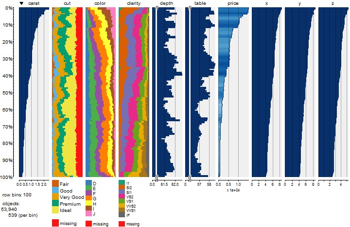
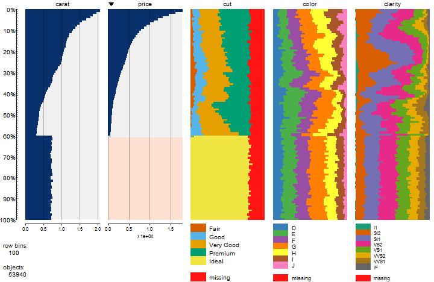
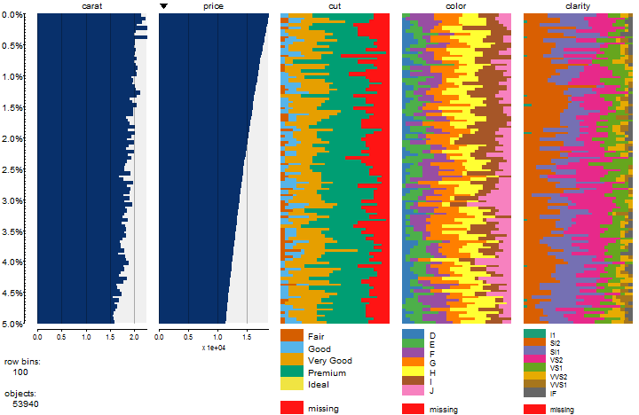
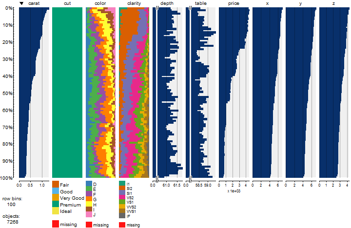
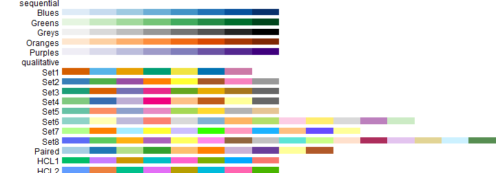
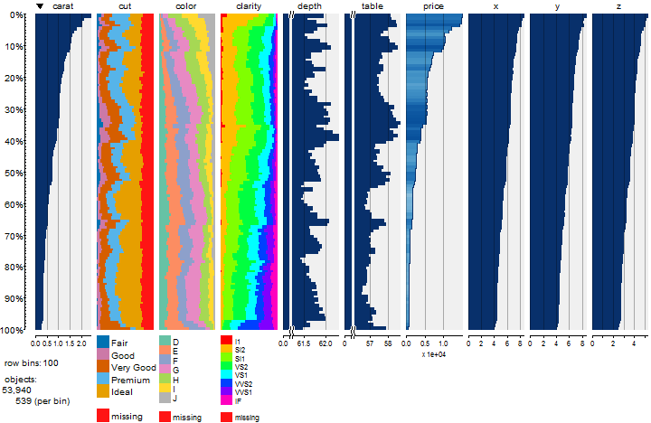
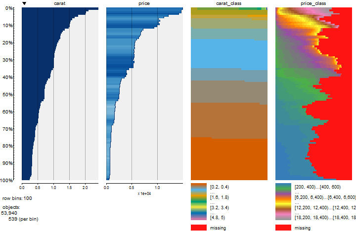
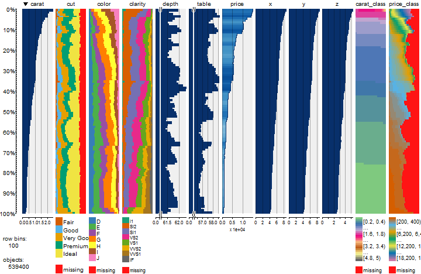
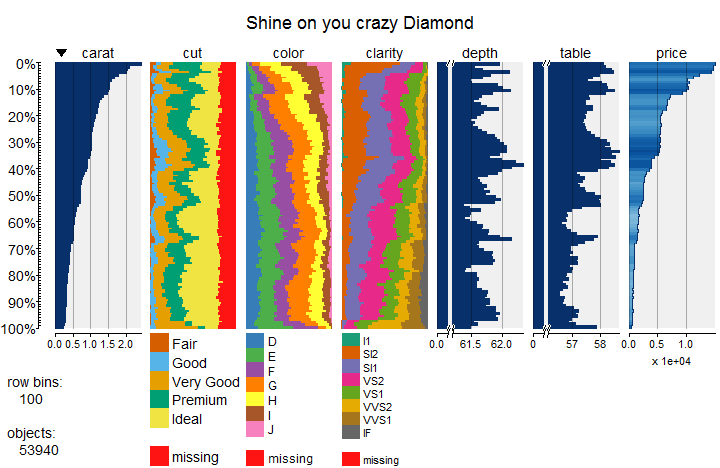
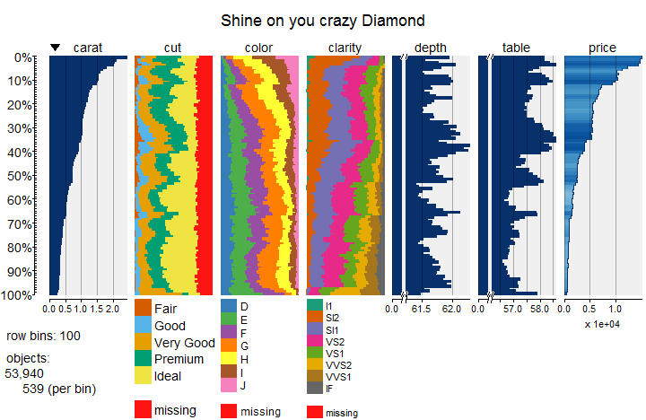

<!--
%\VignetteEngine{knitr::knitr`
%\VignetteIndexEntry{Visualization of large multivariate datasets with the tabplot package`
-->


The tableplot is a powerful visualization method to explore and analyse large multivariate datasets. In this vignette, the implementation of tableplots in R is described, and illustrated with the diamonds dataset from the `ggplot2` package. 

## Introduction

The tableplot is a visualization method that is used to explore and analyse large datasets. Tableplots are used to explore the relationships between the variables, to discover strange data patterns, and to check the occurrence and selectivity of missing values. 

A tableplot applied to the diamonds dataset of the `ggplot2` package (where some missing values were added) is illustrated in the figure below. Each column represents a variable. The whole data set is sorted according to one column (in this case, carat), and then grouped into row bins.

Tableplots are aimed to visualize multivariate datasets with several variabels (up tot a dozen) and a large number of records, say at least one thousand. Tableplots can also be generated for datasets with less records, but they may be less useful. The maximum number of rows that can be visualized with the `tabplot` package depends on the R's memory, or, when using the `ff` package, on the limitations of that package.

## Getting started with the `tableplot` function

The diamonds dataset is very suitable to demonstrate the `tabplot` package. To illustrate the visualization of missing values, we add several `NA`'s.


```r
require(ggplot2)
data(diamonds)
## add some NA's
is.na(diamonds$price) <- diamonds$cut == "Ideal"
is.na(diamonds$cut) <- (runif(nrow(diamonds)) > 0.8)
```


A tableplot is simply created by the function `tableplot`. By default, all variables of the dataset are depicted. With the argument `select`, we can specify which variables are plotted. The dataset is by default sorted according to the values of the first column. With the argument `sortCol`, we can specify on which column(s) the data is sorted.


```r
tableplot(diamonds)
```

 


The tableplot below consists of five columns, where the data is sorted on price. Notice that the missing values that we have added are placed at the bottom and (by default) shown in a bright red color.


```r
tableplot(diamonds, select = c(carat, price, cut, color, clarity), sortCol = price)
```

 


Setting an appropriate number of row bins (with the argument `nBins`) is important, like in a histogram. A good number of row bins is a trade of between good polished but meaningless data, and detailed, but noisy data. In practice, we found that the default number of 100 usually is a good starting point.

The percentages near the vertical axis indicate which subset of the data in terms of units (rows) is depicted. The range from 0% to 100% in the figure above means that all units of the data are plotted.

## Zooming and filtering


### Zooming
We can focus our attention to the 5% most expensive diamonds by setting the `from` argument to 0 and the `to` argument to 5. The resulting tableplot are depicted in the figure below. Observe that the number of row bins is still 100, so that the number of units per row bin is now 27 instead of 540. Therefore, much more detail can be observed in this tableplot.


```r
tableplot(diamonds, select = c(carat, price, cut, color, clarity), sortCol = price, 
    from = 0, to = 5)
```

 


The vertical axis contains two sets of tick marks. The small tick marks correspond with the row bins and the large tick marks correspond with the percentages between `from` and `to`.


### <a name="secfilter"></a>Filtering
The argument `subset` serves as a data filter. The tableplot in the following figure shows that data of premium cut diamonds that cost less than 5000$.


```r
tableplot(diamonds, subset = price < 5000 & cut == "Premium")
```

 


It is also possible to create a tableplot for each category of a categorical variable in one call. For instance, by setting `subset=color` we create a tableplot for each color class.


## Continuous variables

### Scaling
For each bin of a continuous variable, the mean value is calculated.
When the distribution of these mean values is exponential, it is useful to apply a logarithmic transformation. The argument `scales` can be set to linear mode `"lin"`, logarithmic mode `"log"`, or the default value `"auto"`, which automatically determines which of the former two modes is used.

### Used colors
The colors of the bins indicate the fraction of missing values. By default, a sequential color palette of blues is used. If a bin does not contain any missing values, the corresponding bar is depicted in dark blue. The more missing values, the brighter the color. (Alternatively, other quantitative palettes can be used by setting the argument `numPals`) Bars of which all values are missing are depicted in light red.


```r
tablePalettes()
```

 


### X-axes

The x-axes a plotted as compact as possible. This is illustrated in the x-axis for the variable price.

Observe that the x-axes of the variables depth and table in the top figure are broken. In this way the bars are easier to differentiate. The argument `bias\_brokenX` can be set to determine when a broken x-axis is applied.

For each numerical variable, the limits of the x-axes can be determined manually with the argument `limitsX`.


## Categorical variables
### Color palettes
The implemented palettes are depicted in the figure above. These palettes, as well as own palettes, can be assigned to the categorical variables with the argument `pals`.

Suppose we want a to use the default palette for the variable `cut`, but starting with the sixth color, blue. Further we want the fifth palette for the variable `color`, and a custom palette, say a rainbow palette, for the variable `clarity`. The resulting tableplot is depicted in Figure~\ref{fig:tp5`.


```r
tableplot(diamonds, pals = list(cut = "Set1(6)", color = "Set5", clarity = rainbow(8)))
```

 


Also quantitative palettes can be used (for instance by setting `clarity=` `"Greens"`. Missing values are by default depicted in red. This can be changed with the argument `colorNA`.

### High cardinality data
To illustrate how tableplots deal with high cardinality data, we extend the diamonds dataset with a convenient wrapper function `num2fac`:


```r
diamonds$carat_class <- num2fac(diamonds$carat, n = 20)
diamonds$price_class <- num2fac(diamonds$price, n = 100)
```


For variables with over `change\_palette\_type\_at` (by default 20) categories, color palettes are constructed by using interpolated colors. This creates a rainbow effect. If the number of categories is than `change\_palette\_type\_at`, the assigned palette is recycled in order to obtain the number of categories.


```r
tableplot(diamonds, select = c(carat, price, carat_class, price_class))
```

 


If the number of categories exceeds `max\_level` (by default 50), the categories are rebinned into `max\_level` category groups. This is illustrated by the variable price\_class.


## Preprocessing of big data

For large datasets it is recommended to preprocess the data with the function `tablePrepare`. This function determines to sorting order of each data column, the most time consuming task to create tableplots. The advantage of using `tablePrepare` as an intermediate step, is that the processing time to create tabelplots is reduced big time. This is especially useful when experimenting with arguments such as the number the row bins (`nBins`) and the sorting column (`sortCol`), or when using tableplots interactively.

The following example illustrated the tablePrepare function for big data:


```r
# create large dataset
large_diamonds <- diamonds[rep(seq.int(nrow(diamonds)), 10), ]

system.time({
    p <- tablePrepare(large_diamonds)
})
```

```
##    user  system elapsed 
##    1.57    0.40    1.97
```

```r

system.time({
    tableplot(p, plot = FALSE)
})
```

```
##    user  system elapsed 
##    0.19    0.07    0.25
```

```r

system.time({
    tableplot(p, sortCol = price, nBins = 200, plot = FALSE)
})
```

```
##    user  system elapsed 
##    0.29    0.05    0.34
```


Although the first step takes a couple of seconds on a moderate desktop computer, the processing time to create a tableplot from the intermediate result, object `p`, is very short in comparison to the direct approach:


```r
system.time({
    tableplot(large_diamonds, plot = FALSE)
})
```

```
##    user  system elapsed 
##    1.28    0.36    1.66
```

```r

system.time({
    tableplot(large_diamonds, sortCol = price, nBins = 200, plot = FALSE)
})
```

```
##    user  system elapsed 
##    1.25    0.36    1.61
```


## Sampling

To increase the speed even more, it is possible to sample with the argument `sampleBinSize`:


```r
system.time({
    tableplot(p, sample = TRUE)
})
```

 

```
##    user  system elapsed 
##    0.40    0.03    0.44
```


## Miscellaneous

### The tabplot object

The function `tableplot` returns a tabplot-object, that can be used to make minor changes to the tableplot, for instance the order of columns or the color palettes. Of course, these changes can also be made by generating a new tableplot. However, if it takes considerable time to generate a tableplot, then it is practical to make minor changes immediately.

The output of the `tableplot` function can be assigned to a variable. The graphical output can be omitted by setting the argument `plot` to `FALSE`.


```r
tab <- tableplot(diamonds, plot = FALSE)
```


The tabplot-object is a list that contains all information to depict a tableplot. The generic functions `summary` and `plot` can be applied to the `tabplot` object.


```r
summary(tab)
```

```
##       general               variable1            variable2          
##  dataset  :diamonds   name       :carat     name      :cut          
##  variables:12         type       :numeric   type      :categorical  
##  objects  :53940      sort       :TRUE      sort      :NA           
##  bins     :100        scale_init :auto      categories:6            
##  from     :0%         scale_final:lin                               
##  to       :100%                                                     
##       variable3                variable4                 variable5      
##  name      :color         name      :clarity       name       :depth    
##  type      :categorical   type      :categorical   type       :numeric  
##  sort      :NA            sort      :NA            sort       :NA       
##  categories:8             categories:9             scale_init :auto     
##                                                    scale_final:lin      
##                                                                         
##        variable6             variable7             variable8      
##  name       :table     name       :price     name       :x        
##  type       :numeric   type       :numeric   type       :numeric  
##  sort       :NA        sort       :NA        sort       :NA       
##  scale_init :auto      scale_init :auto      scale_init :auto     
##  scale_final:lin       scale_final:lin       scale_final:lin      
##                                                                   
##        variable9             variable10           variable11         
##  name       :y         name       :z         name      :carat_class  
##  type       :numeric   type       :numeric   type      :categorical  
##  sort       :NA        sort       :NA        sort      :NA           
##  scale_init :auto      scale_init :auto      categories:26           
##  scale_final:lin       scale_final:lin                               
##                                                                      
##       variable12         
##  name      :price_class  
##  type      :categorical  
##  sort      :NA           
##  categories:51           
##                          
## 
```

```r
plot(tab)
```


### <a name="secmult"></a>Multiple tableplots

When a dataset contains more variables than can be plotted, multiple tableplots can be generated with the argument `nCols`. This argument determines the maximum number of columns per tableplot. When the number of selected columns is larger than `nCols`, multiple tableplots are generated. In each of them, the sorted columns are plotted on the lefthand side. 

When multiple tableplots are created, the (silent) output is a list of `tabplot` objects. This is also the case when the dataset is filtered by a categorical variable, e.~g. `subset = color`
([link](#secfilter).

### Layout options
There are several arguments that determine the layout of the plot:
`fontsize`, `legend.lines`, `max\_print\_levels`, `text\_NA`, `title`, `showTitle`, `fontsize.` `title`, `showNumAxes`, and `vp`. The following code illustrates this.


```r
tableplot(diamonds, select = 1:7, fontsize = 14, legend.lines = 8, title = "Shine on you crazy Diamond", 
    fontsize.title = 18)
```

 


The layout arguments named above are passed on from `tableplot` to `plot.tabplot`. These arguments will be especially important when saving a tableplot (see [link](#secsave#)).


### Minor changes

The function `tableChange` is used to make minor changes to a tabplot-object. Suppose we want the columns in the order of the top figure, and we want to change all color palettes to default starting with the second color.


```r
tab2 <- tableChange(tab, select_string = c("carat", "price", "cut", "color", 
    "clarity"), pals = list(cut = "Set1(2)"))
plot(tab2)
```

 


### <a name="secsave"></a>Save tableplots

With the function `tableSave`, tableplots can be saved to a desired grahical output format: pdf, eps, svg, wmf, png, jpg, bmp, or tiff.


```r
tableSave(tab, filename = "diamonds.png", width = 5, height = 3, fontsize = 6, 
    legend.lines = 6)
```


All layout options named in [link](#seclay) can be used here, such as `fontsize` and `legend.lines`. When `tab` is a list of tabplot-objects (see [link](#secmult)), the argument `onePage` determines whether the tableplots are stacked on one page or printed on seperate pages.


## Resources

- Summary of the package: `help(package=tabplot)`
- The main help page: `?tabplot`
- Project site: [link](http://code.google.com/p/tableplot)
- Tennekes, M., Jonge, E. de, Daas, P.J.H. (2013) Visualizing and Inspecting Large Datasets with Tableplots, Journal of Data Science 11 (1), 43-58. ([link](http://www.jds-online.com/file_download/379/JDS-1108.pdf))


